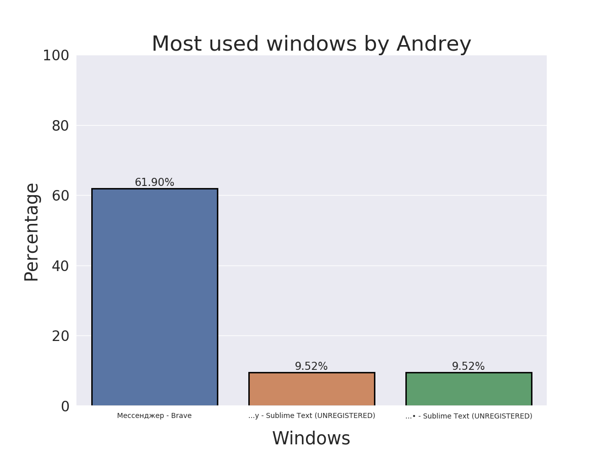

### This repository was created by [Pavel Filippenko](https://github.com/pavel-collab), [Mikhail Ovsiannikov](https://github.com/OAMichael) and [Andrey Barannikov](https://github.com/barannikovav).

### Понадобится установить следующее:
```console
pip install psutil
```
```console
pip install python-libxdo
```
```console
pip install python-telegram-bot
```
```console
pip install seaborn
```
```console
sudo apt-get install python3-gi gir1.2-wnck-3.0
```

#### Что скрипт должен делать:
1. Получить информацию о компьютере данного работника
2. Передать ее на главный сервер
3. Сервер обрабатывает данную информацию:
	- Записывает все в базу данных
	- По возможности строит графики нужных величин
	- Выводит информацию по необходмому запросу
4. ~~Отсылать всю инфу боссу в телегу~~

#### Что скрипт делает на данный момент:
1. На сервере запускает [**телеграм-бота**](https://t.me/Conntrol_test_bot)
2. Каждый клиент получает следующую информацию о своем компьютере и системе:
	- Для каждого процесса получает:
		- Name
		- Create time
		- Status
		- RSS memory
		- VMS memory
		- Shared memory
		- Data memory
	- Количество процессов
	- Использование дисковой памяти
	- Частоту CPU (минимальную, максимальную и текущую)
	- Время запуска системы
	- Общее использование памяти
	- Температуру каждого ядра (текущую, максимальную и критическую)
	- Названия всех открытых окон
	- ID текущего окна
	- Имя текущего окна
	- Наиболее часто используемое окно и процентаж использования
	- Второе наиболее часто используемое окно и процентаж использования (если есть)
	- Третье наиболее часто используемое окно и процентаж использования (если есть)
	- Положение курсора в пикселях экрана (отсчет от левого верхнего края экрана)
	- ID окна над которым расположен курсор
	- Имя окна над которым расположен курсор
3. Вся эта информация передается серверу через TCP протокол. Он записывает все базу данных
4. В телеграм-боте по запросу '/info [Worker name]' выдается информация об активном окне работника по имени [Worker name] и присылается картинка с гистограммой не более трех наиболее используемых окон и процентаж использования.

***Замечание:*** при запуске программы `./Server.py` запускается дочерний процесс с телеграм-ботом `./TGBot.py` (пока что бот жив при условии, что компьютер того, кто запустил `./Server.py`, включен). Тот в свою очередь бесконечно спит, пока ~~босс~~ пользователь телеграма не запросит информацию. Как только это произошло, `./TGBot.py` запускает подпроцесс `./Plot.py` и ждет, пока построится и сохранится график, после чего уже отправляет картинку.


#### Пример гистограммы:


